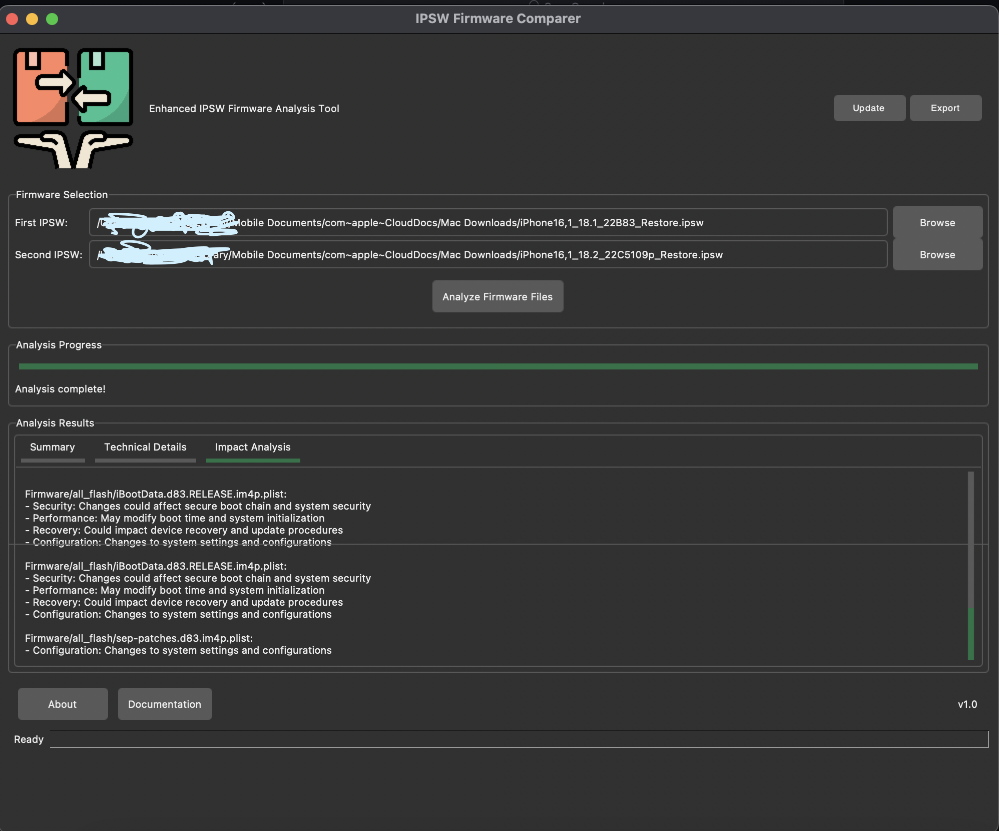
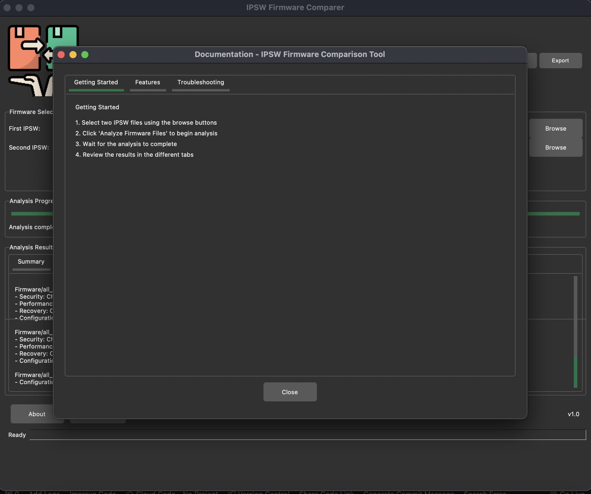

# Enhanced IPSW Firmware Analysis Tool 🔍



A sophisticated tool for analyzing and comparing iOS firmware (IPSW) files, providing detailed insights into system changes, security updates, and potential impacts.

## 🌟 Features

### Core Functionality
- **Firmware Comparison**: Compare two IPSW files to identify changes, additions, and removals
- **Component Analysis**: Deep analysis of system components including kernels, bootloaders, and security elements
- **Security Assessment**: Evaluation of security-related changes and their implications
- **Performance Impact**: Analysis of modifications affecting system performance
- **Change Classification**: Automatic categorization of changes by type and severity

### Analysis Categories
- 🔒 Security Changes
- ⚡ Performance Modifications
- 🛠️ System Component Updates
- 🔄 Boot Chain Changes
- 📱 Feature Updates

### User Interface
- Clean, modern interface with dark theme
- Progress tracking for analysis operations
- Tabbed results view for organized information
- Export capabilities for analysis results
- Context menu for quick actions

## 📋 Requirements

- Python 3.x
- Required Python packages:
  ```bash
  tkinter
  zipfile
  hashlib
  requests
  ```

## 🚀 Installation

### Option 1: Mac App Installation (Recommended)
1. Download the latest release from the [Releases](https://github.com/TermuxHackz/Enhanced-IPSW-Firmware-Analysis-Tool/releases) page
2. Download `IPSW Firmware Comparison Tool.dmg`
3. Double-click the downloaded DMG file
4. Drag the "IPSW Firmware Comparison Tool" app to your Applications folder
5. Go to Applications folder and right-click on "IPSW Firmware Comparison Tool.dmg"
6. Click "Open" and confirm to run the application
   > Note: On first launch, macOS might show a security prompt since the app is from an unidentified developer. 
   > To resolve this:
   > - Go to System Preferences > Security & Privacy
   > - Click the lock to make changes
   > - Click "Open Anyway" for IPSW Firmware Analyzer

### Option 2: Run from Source
1. Clone the repository:
   ```bash
   git clone https://github.com/TermuxHackz/Enhanced-IPSW-Firmware-Analysis-Tool.git
   ```

2. Install required packages:
   ```bash
   pip install -r requirements.txt
   ```

3. Run the application:
   ```bash
   python3 ipsw_firmware_tool.py
   ```

### System Requirements
- macOS 10.15 (Catalina) or later
- 4GB RAM minimum (8GB recommended)
- 500MB free disk space for installation
- Additional space required for IPSW analysis (varies by firmware size)


## Logs
- Logs from the application are saved in:
<code>~/Library/Logs/IPSWComparisonTool</code>


### Basic Operation

1. **Launch the Application**
   - Run the script to open the GUI interface

2. **Select Firmware Files**
   - Click "Browse" to select your first IPSW file
   - Select the second IPSW file for comparison
   - Click "Analyze Firmware Files" to begin analysis

3. **View Results**
   Results are organized into three main tabs:
   - **Summary**: Overview of key changes and recommendations
   - **Technical Details**: In-depth technical analysis of modifications
   - **Impact Analysis**: Evaluation of potential impacts on device operation

### Understanding Results

#### Summary Tab
- Overview of total changes
- Critical component modifications
- Security update summary
- Update priority assessment
- Recommendations for installation

#### Technical Details Tab
- Detailed component-level changes
- File modifications list
- System impact analysis
- Component dependencies

#### Impact Analysis Tab
- Security implications
- Performance impacts
- Feature modifications
- Compatibility considerations

### 📤 Exporting Results

Results can be exported in multiple ways:
1. Click the "Export" button in the toolbar
2. Use File → Export Analysis from the menu
3. Right-click in results area and select "Export Selection"

Export formats include:
- Detailed text report
- Technical summary
- Component change list

## 🔄 Update Process

The tool includes an update checker:
1. Click "Updates" in the toolbar
2. If updates are available, review the changelog
3. Download and install the latest version

## 🛠️ Technical Details

### Analysis Process
1. **Extraction**: IPSW files are extracted to temporary locations
2. **Comparison**: Files are compared using SHA-256 hashing
3. **Analysis**: Changes are categorized and analyzed
4. **Impact Assessment**: AI-enhanced analysis of potential impacts

### Component Analysis
- Kernel modifications
- Security certificate changes
- System framework updates
- Boot chain modifications
- Trust cache updates

## 📊 Sample Analysis Output

```
=== IPSW Firmware Update Analysis ===
Analysis Date: 2024-02-10 15:30:45
Firmware Comparison: Version 16.5.1 → 16.6

Key Findings:
• 3 Critical system changes detected
• 12 Security components modified
• 5 Performance-related updates
• Boot chain modifications present

Recommendations:
✓ High priority security update
✓ Backup device before updating
✓ Monitor performance after update
```

## 🤝 Contributing

Contributions are welcome! Please read our [Contributing Guidelines](CONTRIBUTING.md) before submitting pull requests.

### Development Setup
1. Fork the repository
2. Create a feature branch
3. Implement changes
4. Submit pull request

## 📝 Version History
- v1.0.1 (latest)
    - Fixed GUI not working when building

- v1.0.0 (Older)
  - Initial release
  - Core comparison functionality
  - Advanced analysis features
  - Dark theme UI

## 📄 License

This project is licensed under the MIT License - see the [LICENSE](LICENSE) file for details.

## 🙏 Acknowledgments

- Forest-ttk-theme for the UI theme
- Contributors and testers
- iOS security research community

## 💬 Support

- Create an issue for bug reports
- Email: techcodes@tracetech.me.uk

## 📸 Screenshots



*Made with ❤️ by [AnonyminHack5]*
